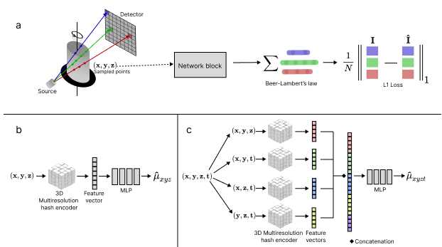

# NeCT: Neural Computed Tomography

[Paper (to be added)](){: .md-button .md-button--primary .md-button--large}
[Code :fontawesome-brands-github:](https://github.com/haakonnese/nect){: .md-button .md-button--primary .md-button--large}

NeCT leverages deep learning to improve computed tomography (CT) image quality, supporting both static and dynamic CT reconstruction. The project is a collaboration between the Norwegian Univeristy of Science and Technology (NTNU) and the CT lab at Equinor.  The project is based on the INR framework [`tiny-cuda-nn`](https://github.com/NVlabs/tiny-cuda-nn/).

- [User guide](userguide/start/index.md)
  - [Installation](userguide/start/installation.md)
  - [Quick start](userguide/start/quickstart.md)
  - [Geometry configuration](userguide/geometry.md)
  - [Configuration](userguide/config.md)
- [Demo](userguide/demo/index.md)
- [Licensing and Citation](about/licensing-and-citation.md)

## Showcase: Bentheimer Sandstone Imbibition

<figure>
    <video width="1080" controls autoplay muted loop>
            <source src="images/showcase1.mp4" type="video/mp4">
            Your browser does not support the video tag.
    </video>
    <figcaption>
        Rendering of spontaneous imbibition in a Bentheimer sandstone reconstructed using NeCT. The brine flowing into the sample is shown in light blue, while the salt grains dissolving are presented in red. The video recording was started when brine entered the core.
    </figcaption>
</figure>

<figure>
    <video width="1080" controls autoplay muted loop>
    <source src="images/showcase2.mp4" type="video/mp4">
    Your browser does not support the video tag.
    </video>
    <figcaption>
        Rendering of the dissolution of a salt grain. Three orthogonal slices visualize its temporal evolution. In the xz slice, it is possible to observe the brine coming into contact with the salt before it starts to dissolve.
    </figcaption>
</figure>
